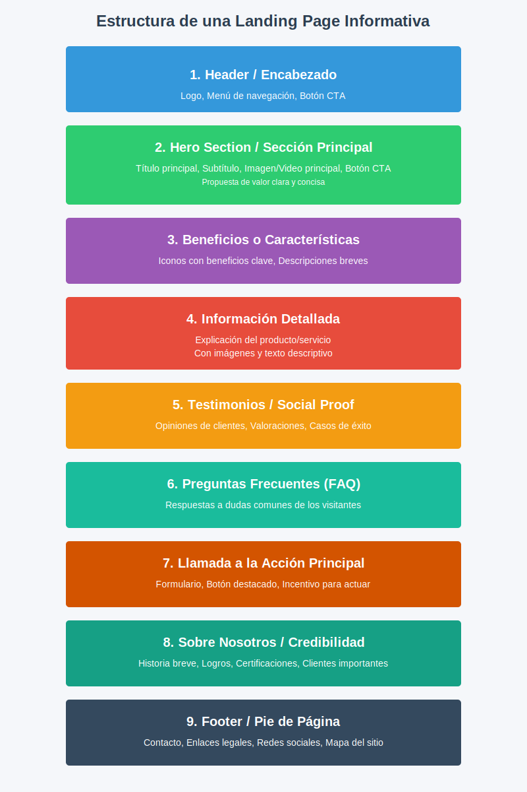

# Documentación: Landing Page de CyberSea

## 🌊 Visión General

El componente Landing Page de CyberSea es una estructura modular que sirve como punto de entrada principal para los usuarios. Está diseñado utilizando principios de componentes independientes y reutilizables de Angular (standalone components), lo que facilita el mantenimiento y las actualizaciones.



## 📂 Estructura de Archivos

```
landing/
├── landing.component.ts      # Componente principal que encapsula toda la landing page
├── landing.component.html    # Template principal (simplemente incorpora main-view)
├── landing.component.css     # Estilos del componente principal
├── landing.routes.ts         # Configuración de rutas para la landing page
├── components/               # Componentes modulares que forman la landing page
│   ├── header/               # Barra de navegación superior
│   ├── hero-section/         # Sección principal con llamada a la acción
│   ├── benefits-section/     # Sección de beneficios de la plataforma
│   ├── information-section/  # Sección de información sobre problemas de ciberseguridad
│   ├── socialproof-section/  # Sección de testimonios con carrusel
│   ├── faq-section/          # Preguntas frecuentes (actualmente comentado)
│   ├── cta-section/          # Llamada a la acción secundaria (actualmente comentado)
│   ├── aboutus-section/      # Información sobre el equipo (actualmente comentado)
│   └── footer/               # Pie de página
├── utils/                    # Utilidades compartidas
│   └── animations.utils.ts   # Animaciones reutilizables
└── views/                    # Vistas compuestas
    └── main-view/            # Vista principal que orquesta todos los componentes
```

## 🧩 Componentes Principales

### 1. Header Component (`header/`)

**Descripción**: Barra de navegación que cambia su apariencia según la posición de desplazamiento.

**Características clave**:
- Detección de scroll para cambiar estilos (transparente en la parte superior, con fondo al desplazar)
- Menú responsive con soporte para drawer en dispositivos móviles
- Logo y enlaces de navegación (actualmente comentados)

**Implementación técnica**:
```typescript
// Detecta la posición del scroll y modifica el atributo data-at-top
ngAfterViewInit() {
  if (this.topbar) {
    window.addEventListener('scroll', this.handleScroll, { passive: true });
    this.handleScroll();
  }
}
```

### 2. Hero Section (`hero-section/`)

**Descripción**: Sección principal con mensaje de bienvenida y llamada a la acción.

**Características clave**:
- Texto cambiante ("Interactiva"/"Divertida") con animación de fade
- Mockup de teléfono con imagen de la aplicación
- Botón de llamada a la acción principal

**Implementación técnica**:
```typescript
// Animación de texto alternante cada 15 segundos
startAnimate(ref: DestroyRef) {
  interval(15000)
  .pipe(takeUntilDestroyed(ref))
  .subscribe(() => {
    this.textState.update((state) => state === 'fun' ? 'interactive' : 'fun');
  });
}
```

### 3. Benefits Section (`benefits-section/`)

**Descripción**: Presenta las ventajas principales de la plataforma en un diseño de cuadrícula.

**Características clave**:
- Cuatro tarjetas con iconos SVG
- Layout responsive que adapta la cuadrícula según el tamaño de pantalla
- Cada beneficio tiene un título y descripción corta

### 4. Information Section (`information-section/`)

**Descripción**: Sección informativa sobre problemas de ciberseguridad con estadísticas.

**Características clave**:
- Tarjetas alternantes con diseño inverso para mejor ritmo visual
- Ilustraciones SVG complementando cada punto estadístico
- Información sobre ciberacoso, sexting y tiempo en línea

### 5. SocialProof Section (`socialproof-section/`)

**Descripción**: Carrusel de testimonios de profesionales sobre la plataforma.

**Características clave**:
- Implementación de Swiper para el carrusel
- Testimonios con avatar, calificación de estrellas y cargo
- Navegación y paginación

**Implementación técnica**:
```typescript
// Inicialización del carrusel Swiper
ngAfterViewInit(): void {
  this.initSwiper();
}

private initSwiper(): void {
  this.swiper = new Swiper('#testimonial-swiper', {
    modules: [Navigation, Pagination, Autoplay],
    // Configuración del carrusel
    // ...
  });
}
```

### 6. Componentes Adicionales (Actualmente Comentados)

- **FAQ Section**: Acordeón de preguntas frecuentes
- **CTA Section**: Formulario de contacto y llamada a la acción secundaria
- **About Us Section**: Información sobre el equipo y la empresa

### 7. Footer (`footer/`)

**Descripción**: Pie de página con información de copyright.

**Características clave**:
- Sección de copyright activa
- Secciones comentadas para enlaces legales, información de contacto y redes sociales

## 🔄 Flujo de Navegación

El flujo está diseñado para guiar al usuario a través de una experiencia narrativa:

1. **Introducción**: Header + Hero Section presentan el concepto general
2. **Valor**: Benefits Section muestra las ventajas principales
3. **Contexto**: Information Section establece el problema y la necesidad
4. **Validación**: SocialProof Section proporciona evidencia social
5. **Cierre**: Footer (y potencialmente CTA Section cuando se active)

## 🛠️ Configuración y Personalización

### Activación de Secciones Comentadas

Para activar las secciones comentadas (FAQ, CTA, About Us), descomentar las líneas correspondientes en main-view.component.html:

```html
<landing-header></landing-header>
<landing-hero-section></landing-hero-section>
<landing-benefits-section></landing-benefits-section>
<landing-information-section></landing-information-section>
<landing-socialproof-section></landing-socialproof-section>
<landing-faq-section></landing-faq-section> <!-- Descomentar -->
<landing-cta-section></landing-cta-section> <!-- Descomentar -->
<landing-aboutus-section></landing-aboutus-section> <!-- Descomentar -->
<landing-footer></landing-footer>
```

### Personalización del Header

Para activar el menú de navegación, descomentar las secciones de menú en header.component.html:

```html
<div class="max-lg:hidden">
    <ul class="menu menu-horizontal gap-2 px-1">
        <li class="font-medium"><a href="#home">Inicio</a></li>
        <!-- Agregar más elementos de menú -->
    </ul>
</div>
```

## 📱 Consideraciones de Rendimiento y Responsive

- Todos los componentes utilizan `ChangeDetectionStrategy.OnPush` para mejorar el rendimiento
- El carrusel de testimonios en `socialproof-section` utiliza carga lazy para optimizar el rendimiento
- El componente header se adapta a diferentes tamaños de pantalla con un diseño drawer para móviles
- La estructura de grid en benefits-section se ajusta automáticamente según el viewport

## 📦 Dependencias Principales

- **Swiper**: Para el carrusel de testimonios
- **Iconify**: Para los iconos utilizados en varios componentes
- **Angular Signals**: Para el manejo de estado reactivo en componentes como hero-section

## 🔍 Recomendaciones para Desarrollo

1. Completar y personalizar el contenido de las secciones FAQ, CTA y About Us
2. Actualizar las imágenes de mockup en el Hero Section con capturas reales de la aplicación
3. Implementar navegación smooth-scroll al hacer clic en los elementos del menú
4. Configurar analíticas para rastrear conversiones de los botones CTA
5. Considerar la implementación de lazy-loading para optimizar la carga inicial

## 🧪 Pruebas

Para probar la landing page por completo es recomendable:

1. Verificar el comportamiento responsive en diferentes dispositivos
2. Comprobar que las animaciones y transiciones funcionan correctamente
3. Validar que el carrusel de testimonios funciona en todos los navegadores principales
4. Verificar la accesibilidad de los elementos interactivos

## 📚 Recursos Adicionales

- [Documentación de Angular](https://angular.dev/)
- [Documentación de Swiper](https://swiperjs.com/api/)
- [Guía de DaisyUI](https://daisyui.com/components/)

---

Desarrollado por el equipo de CyberSea para el Centro Universitario de Guadalajara (CUGDL).
